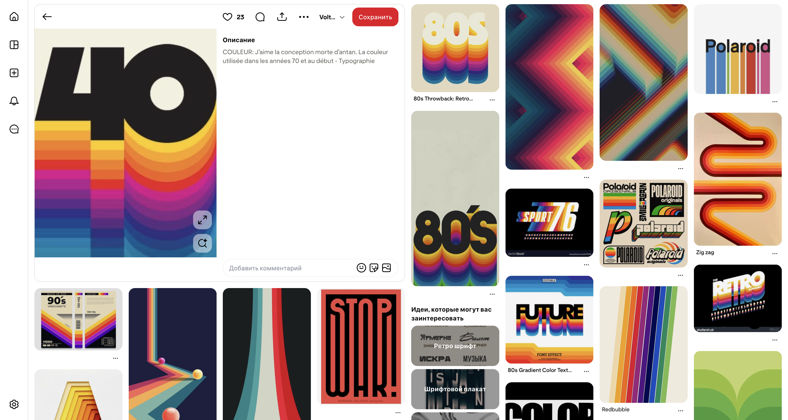

# GitHub Banner Logo Prompt

A minimal wrapper for generating a GitHub social preview / README banner from two inputs:

1. a GitHub repository URL
2. a reference-board image for style

The full prompt lives in [`prompt.md`](prompt.md). Replace:

```md
{{GITHUB_REPOSITORY_URL}}
{{REFERENCE_BOARD_IMAGE}}
```

then send the prompt to an agent or image generator.

## Example

| Reference board | Generated banner |
|---|---|
|  |  |
|  |  |

## Usage

```md
Repository:
https://github.com/user/project

Reference board:
attached image
```

The agent should then:
- inspect the repository
- keep repository content separate from reference-board style
- describe the visual concept first
- generate a 1280x640 banner under 1 MB
